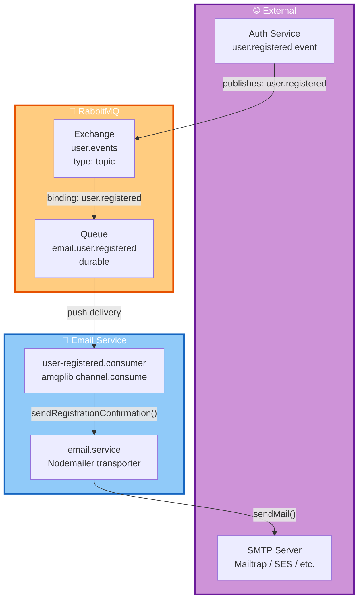

# Email Service - Architecture

## Architecture Diagram

```mermaid
graph TB
    subgraph External["🌐 External"]
        AuthService[Auth Service<br/>user.registered event]
        SMTP[SMTP Server<br/>Mailtrap / SES / etc.]
    end

    subgraph RabbitMQ["📨 RabbitMQ"]
        Exchange[Exchange<br/>user.events<br/>type: topic]
        Queue[Queue<br/>email.user.registered<br/>durable]
    end

    subgraph EmailService["📧 Email Service"]
        Consumer[user-registered.consumer<br/>amqplib channel.consume]
        Service[email.service<br/>Nodemailer transporter]
    end

    AuthService -- "publishes: user.registered" --> Exchange
    Exchange -- "binding: user.registered" --> Queue
    Queue -- "push delivery" --> Consumer
    Consumer -- "sendRegistrationConfirmation()" --> Service
    Service -- "sendMail()" --> SMTP

    style External fill:#ce93d8,stroke:#6a1b9a,stroke-width:3px,color:#fff
    style RabbitMQ fill:#ffcc80,stroke:#e65100,stroke-width:3px,color:#fff
    style EmailService fill:#90caf9,stroke:#1565c0,stroke-width:3px,color:#fff
```
